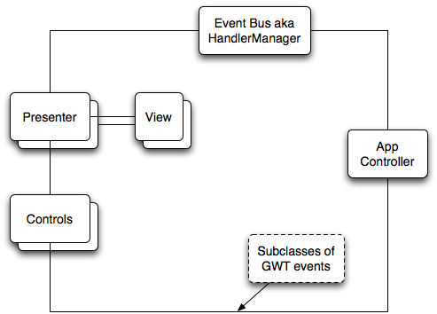

# Project Gimv

Gimv provides widgets and workflows to implement a chart viewer based on [GWT](http://www.gwtproject.org/) (Google Web Toolkit)

# Usage in GWT project

* Execute  ./gradlew clean :lib:jar to generate the jar file in `lib/build/libs` (not located in maven repository)
* Reference the jar file in the build path/classpath of your project, e.g. in gradle depdencies section with `implementation files("${rootProject.projectDir}/libs/gimv-1.0.1.jar")`
* Add the following to your module.gwt.xml: &lt;inherits name='org.eesgmbh.gimv.Gimv'>
* Tested with Java 11

# JFreeChart sample

This sample is a java web application that renders a line chart on the server side, so the Gimv client components
can show it on the client side. It uses the library [JFreeChart](http://www.jfree.org/jfreechart/)

* It can be build with the gradle task `war`. The resulting war file can be deployed to a servlet container like Tomcat or Jetty
* It can be started in GWT Dev mode (instant recompilation of changes) with ` ./gradlew samples:jfreechart:gwtDev`

The sample uses a number of Gimv components:
* an overview component that shows the current range of the main image within a larger range. The overview can be moved or resized.
* a presenter to shift the image to any direction by clicking on some form of clickable widget
* there is support for keys
* tooltips at the current mouse location can be displayed
* the layout is dynamic meaning that changes in the viewport size due to browser window resizes will trigger the rendering of a new image with the altered dimensions

Note, that the sample is quite slow in GWT development mode due to the high number of tooltips transmitted from server to client. Everything is alright in normal Javascript mode.

# Notes on architecture

The Gimv Framework adheres to the design guidelines described in the article
[Large scale application development and MVP](http://www.gwtproject.org/articles/mvp-architecture.html) and outlined quite vividly in a [talk by Rad Ryan](http://www.youtube.com/watch?v=PDuhR18-EdM).

It basically boils down to three things as far as Gimv is concerned:

* Any kind of state change (e.g. because of a user action) will be encapsulated in events. Event handlers can be register for a certain event and will subsequently receive those events.
* A user interface component is divided into two parts, a presenter where UI logic is implemented and a view class that contains the actual GWT widgets and manages only trivial display logic.
* There must be some kind of controller component that deals with the actual rendering of the image.

We introduced the component type _Control_ that unlike a presenter does not have a visual counterpart (a view) but still participates in the overall application by receiving, processing and firing events.

A simple use case might be the controller telling the presenters and controls of a new image with certain properties (e.g. in a time series chart, the image url and its dimensions like the time range and value range). The presenter responsible for the image invokes its view to display the new image.
When the user subsequently drags the image, a control will react to the mouse movements and will tell the controller that it should render an image with the altered bounds.

